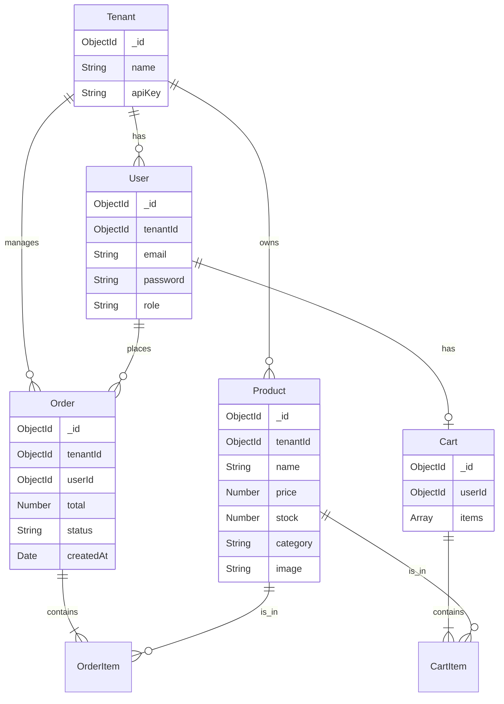

# Diagrama ERS - PowerPlay Backend

```mermaid
erDiagram
    Tenant ||--o{ User : "has"
    Tenant ||--o{ Product : "owns"
    Tenant ||--o{ Order : "manages"
    
    User ||--o{ Order : "places"
    User ||--o| Cart : "has"
    
    Cart ||--|{ CartItem : "contains"
    Order ||--|{ OrderItem : "contains"
    
    Product ||--o{ CartItem : "is_in"
    Product ||--o{ OrderItem : "is_in"

    Tenant {
        ObjectId _id
        String name
        String apiKey
    }

    User {
        ObjectId _id
        ObjectId tenantId
        String email
        String password
        String role
    }

    Product {
        ObjectId _id
        ObjectId tenantId
        String name
        Number price
        Number stock
        String category
        String image
    }

    Order {
        ObjectId _id
        ObjectId tenantId
        ObjectId userId
        Number total
        String status
        Date createdAt
    }

    Cart {
        ObjectId _id
        ObjectId userId
        Array items
    }
```
